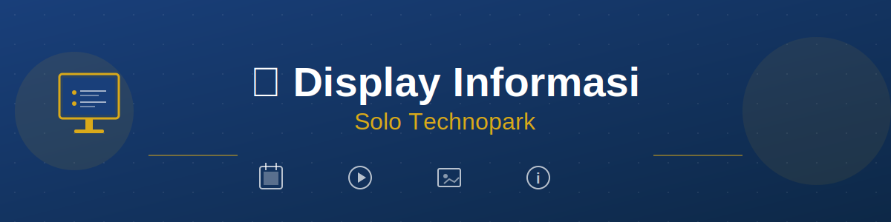
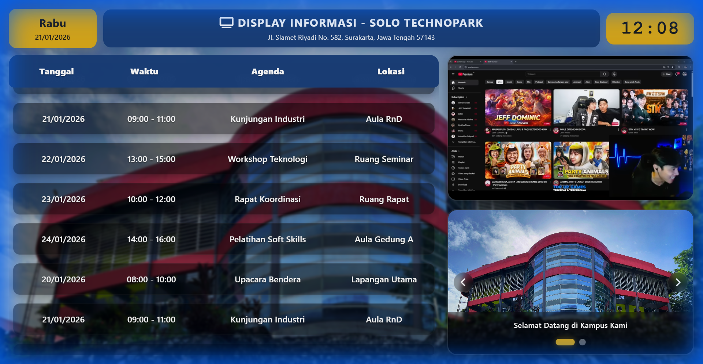
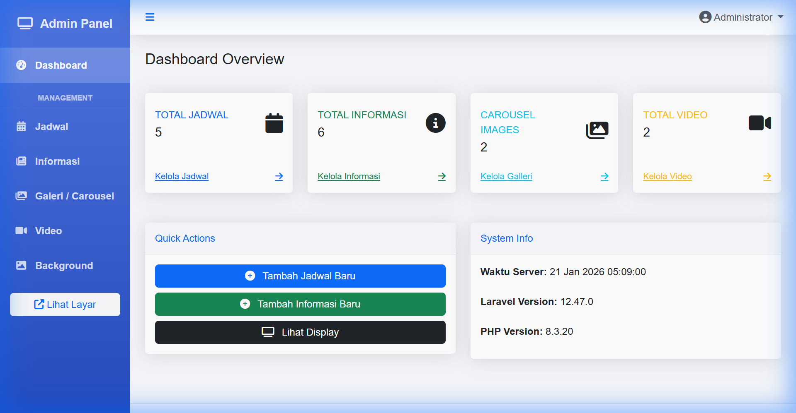
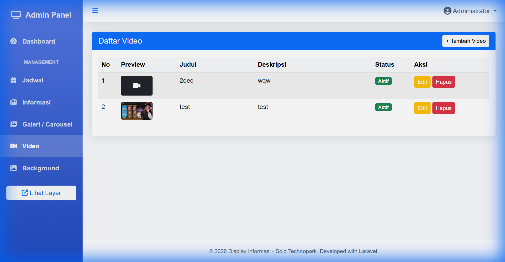

<div align="center">



# 📺 Display Informasi - Solo Technopark

**Sistem Informasi Digital Display untuk Solo Technopark**

[](https://laravel.com)
[](https://php.net)
[](LICENSE)

[Features](#-features) • [Screenshots](#-screenshots) • [Installation](#-installation) • [Usage](#-usage) • [Contributing](#-contributing)

</div>

---

## 📋 Tentang Project

**Display Informasi** adalah aplikasi web berbasis Laravel untuk menampilkan informasi digital di Solo Technopark. Sistem ini menyediakan tampilan dinamis untuk jadwal kegiatan, video, carousel gambar, dan informasi penting lainnya.

### ✨ Features

- 🗓️ **Manajemen Jadwal** - Kelola jadwal kegiatan dengan tanggal, waktu, agenda, dan lokasi
- 🎥 **Video Display** - Tampilkan video YouTube dengan autoplay dan loop
- 🖼️ **Image Carousel** - Slideshow gambar dengan caption dan urutan custom
- 📰 **Informasi** - Kelola informasi/pengumuman dengan gambar dan video
- 🎨 **Background Custom** - Atur background display dengan posisi custom
- 📱 **Responsive Design** - Tampilan optimal di berbagai ukuran layar
- 🔄 **Auto-scroll** - Jadwal scroll otomatis dengan infinite loop
- ⚡ **Real-time Updates** - Jam dan tanggal update secara real-time

### 🛠️ Tech Stack

- **Backend:** Laravel 12.x
- **Frontend:** Blade Templates, Vanilla CSS, JavaScript
- **Database:** MySQL / SQLite
- **UI Framework:** Bootstrap 5.3
- **Icons:** Font Awesome 6.4

---

## 📸 Screenshots

<div align="center">

### Display Utama


### Admin Panel


### Manajemen Video


</div>

---

## 🚀 Installation

### Prerequisites

Pastikan sistem Anda sudah terinstall:

- PHP >= 8.2
- Composer
- Node.js & NPM
- MySQL / SQLite
- Web Server (Apache / Nginx)

### Step-by-Step Installation

#### 1️⃣ Clone Repository

```bash
git clone https://github.com/Azizaac/display_informasi_v2.git
cd display-informasi-v2
```

#### 2️⃣ Install Dependencies

```bash
# Install PHP dependencies
composer install

# Install Node dependencies
npm install
```

#### 3️⃣ Environment Setup

```bash
# Copy environment file
cp .env.example .env

# Generate application key
php artisan key:generate
```

#### 4️⃣ Database Configuration

Edit file `.env` dan sesuaikan konfigurasi database:

**Untuk MySQL:**
```env
DB_CONNECTION=mysql
DB_HOST=127.0.0.1
DB_PORT=3306
DB_DATABASE=display_informasi
DB_USERNAME=root
DB_PASSWORD=
```

**Untuk SQLite:**
```env
DB_CONNECTION=sqlite
# DB_HOST, DB_PORT, DB_DATABASE, DB_USERNAME, DB_PASSWORD tidak perlu diisi
```

Jika menggunakan SQLite, buat file database:
```bash
touch database/database.sqlite
```

#### 5️⃣ Run Migrations

```bash
php artisan migrate
```

#### 6️⃣ Create Storage Link

```bash
php artisan storage:link
```

#### 7️⃣ Build Assets

```bash
npm run build
```

#### 8️⃣ Run Application

**Development:**
```bash
php artisan serve
```

Aplikasi akan berjalan di `http://localhost:8000`

**Production:**
```bash
# Build production assets
npm run build

# Configure web server (Apache/Nginx) to point to /public directory
```

---

## 📖 Usage

### Akses Aplikasi

- **Display Utama:** `http://localhost:8000/`
- **Admin Panel:** `http://localhost:8000/admin`

### Admin Panel Modules

#### 1. Dashboard
- Overview statistik
- Quick access ke semua module

#### 2. Jadwal
- **Create:** Tambah jadwal baru dengan tanggal, waktu, agenda, lokasi, dan PIC
- **Read:** Lihat daftar semua jadwal
- **Update:** Edit jadwal yang sudah ada
- **Delete:** Hapus jadwal

#### 3. Video
- **Create:** Tambah video YouTube (paste URL YouTube)
- **Read:** Lihat daftar video dengan preview
- **Update:** Edit judul, deskripsi, URL, dan status
- **Delete:** Hapus video
- **Note:** Hanya 1 video aktif yang akan ditampilkan di display

#### 4. Carousel
- **Create:** Tambah gambar carousel dengan URL atau upload file
- **Read:** Lihat daftar carousel dengan preview
- **Update:** Edit gambar, caption, urutan, dan status
- **Delete:** Hapus carousel
- **Features:** Auto-rotate setiap 5 detik

#### 5. Informasi
- **Create:** Tambah informasi dengan judul, isi, kategori, gambar, dan video
- **Read:** Lihat daftar informasi
- **Update:** Edit informasi
- **Delete:** Hapus informasi

#### 6. Background
- **Create:** Tambah background dengan URL atau upload file
- **Read:** Lihat daftar background
- **Update:** Edit background dan posisi (center, top, bottom, etc.)
- **Delete:** Hapus background
- **Note:** Hanya 1 background aktif yang akan ditampilkan

---

## 🗂️ Project Structure

```
display-informasi-v2/
├── app/
│   ├── Http/
│   │   └── Controllers/
│   │       ├── AdminController.php
│   │       ├── BackgroundImageController.php
│   │       ├── CarouselController.php
│   │       ├── DisplayController.php
│   │       ├── InformasiController.php
│   │       ├── JadwalController.php
│   │       └── VideoController.php
│   └── Models/
│       ├── BackgroundImage.php
│       ├── Carousel.php
│       ├── Informasi.php
│       ├── Jadwal.php
│       └── Video.php
├── database/
│   └── migrations/
├── public/
│   └── storage/          # Symlink to storage/app/public
├── resources/
│   └── views/
│       ├── admin/        # Admin panel views
│       ├── display/      # Display views
│       └── layouts/      # Layout templates
├── routes/
│   └── web.php
└── storage/
    └── app/
        └── public/       # Uploaded files
```

---

## 🎨 Customization

### Mengubah Warna Tema

Edit file `resources/views/display/index.blade.php`:

```css
:root {
    --primary: #193F7A;    /* Biru utama */
    --secondary: #D9A91A;  /* Gold */
    --text: #ffffff;       /* Text color */
}
```

### Mengubah Kecepatan Scroll Jadwal

Edit file `resources/views/display/index.blade.php`:

```javascript
const scrollSpeed = 30; // Ubah nilai ini (default: 30)
```

### Mengubah Interval Carousel

Edit file `resources/views/display/index.blade.php`:

```javascript
setInterval(() => changeSlide(1), 5000); // Ubah 5000 (5 detik)
```

---

## 🔧 Troubleshooting

### Video YouTube Tidak Muncul

**Penyebab:** Video tidak mengizinkan embedding

**Solusi:** 
1. Pastikan video YouTube bersifat public
2. Gunakan video yang mengizinkan embedding
3. Ganti dengan video lain jika masih tidak bisa

### Gambar Tidak Muncul

**Penyebab:** Storage link belum dibuat

**Solusi:**
```bash
php artisan storage:link
```

### Error 500 Setelah Upload File

**Penyebab:** Permission folder storage

**Solusi:**
```bash
chmod -R 775 storage
chmod -R 775 bootstrap/cache
```

### Jadwal Tidak Auto-scroll

**Penyebab:** JavaScript error atau data jadwal kosong

**Solusi:**
1. Buka browser console (F12) untuk cek error
2. Pastikan ada minimal 1 jadwal di database
3. Clear browser cache dan refresh

---

## 🤝 Contributing

Contributions are welcome! Please feel free to submit a Pull Request.

1. Fork the Project
2. Create your Feature Branch (`git checkout -b feature/AmazingFeature`)
3. Commit your Changes (`git commit -m 'Add some AmazingFeature'`)
4. Push to the Branch (`git push origin feature/AmazingFeature`)
5. Open a Pull Request

---

## 📝 License

This project is licensed under the MIT License - see the [LICENSE](LICENSE) file for details.

---

## 👥 Authors

- **Solo Technopark Team** - *Initial work*

---

## 🙏 Acknowledgments

- Laravel Framework
- Bootstrap
- Font Awesome
- Solo Technopark

---

<div align="center">

**Made with ❤️ for Solo Technopark**

Jl. Slamet Riyadi No. 582, Surakarta, Jawa Tengah 57143

</div>
