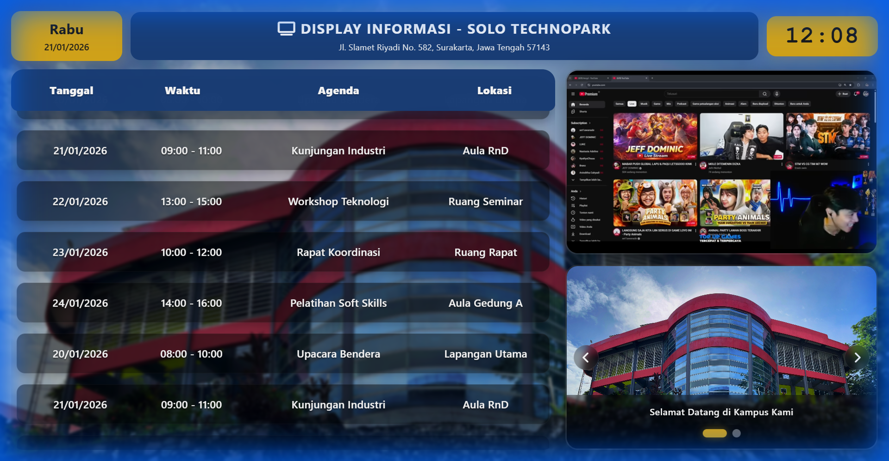
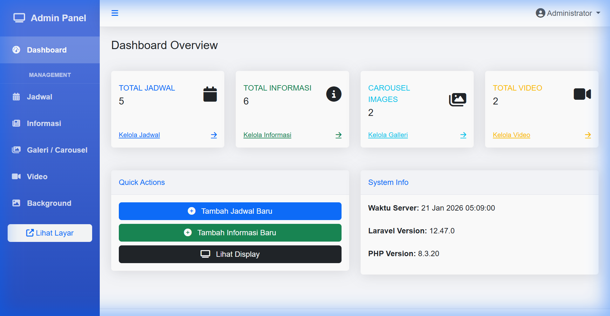
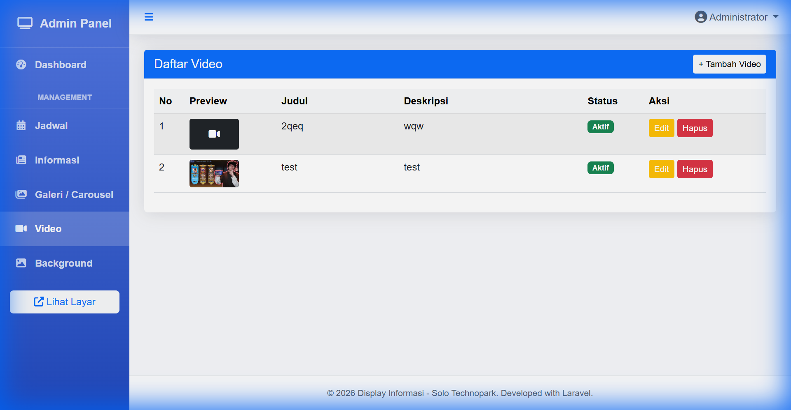

<div align="center">

# 📺 Display Informasi - Solo Technopark

**Sistem Informasi Digital Display Modern untuk Solo Technopark**

[](https://laravel.com)
[](https://php.net)
[](LICENSE)

[Features](#-features) • [Screenshots](#-screenshots) • [Installation](#-installation) • [Usage](#-usage) • [Documentation](#-documentation)

</div>

---

## 📋 Tentang Project

**Display Informasi** adalah aplikasi web berbasis Laravel untuk menampilkan informasi digital di Solo Technopark. Sistem ini menyediakan tampilan dinamis untuk jadwal kegiatan, video YouTube, carousel gambar, dan informasi penting lainnya dengan interface yang modern dan user-friendly.

### ✨ Features

- 🗓️ **Manajemen Jadwal** - Kelola jadwal kegiatan dengan mudah, lengkap dengan waktu, lokasi, dan penanggung jawab.
- 🔄 **Sinkronisasi Otomatis** - Integrasi cerdas untuk impor data jadwal langsung dari Google Spreadsheet (.csv).
- 🎥 **Video Display** - Pemutar video YouTube terintegrasi dengan fitur autoplay, mute, dan looping untuk konten promosi.
- 🖼️ **Image Carousel** - Slideshow gambar dinamis untuk menampilkan poster, pengumuman, atau dokumentasi kegiatan.
- 📰 **Informasi & Berita** - Modul tambahan untuk mengelola konten pengumuman berbasis teks dan gambar.
- 🎨 **Background Dinamis** - Kustomisasi latar belakang layar display sesuai dengan tema atau kebutuhan visual.
- ⚙️ **Pengaturan Instan** - Ubah teks header, subtitle, dan konfigurasi lainnya langsung melalui Admin Panel tanpa menyentuh kode.
- 📱 **Desain Adaptif** - Layout yang responsif dan proporsional untuk berbagai jenis layar monitor dan smart TV.
- ⚡ **Update Real-time** - Sinkronisasi waktu dan refresh konten secara otomatis untuk informasi yang selalu aktual.
- 🔐 **Keamanan Terjamin** - Autentikasi Admin Panel yang aman untuk melindungi integritas data informasi.

### 🛠️ Tech Stack

- **Backend:** Laravel 12.x
- **Frontend:** Blade Templates, Vanilla CSS, JavaScript
- **Database:** MySQL / SQLite
- **UI Framework:** Bootstrap 5.3
- **Icons:** Font Awesome 6.4
- **Authentication:** Laravel Breeze

---

## 📸 Screenshots

<div align="center">

### Display Utama

*Tampilan layar informasi dengan jadwal auto-scroll, video YouTube, dan carousel gambar*

### Admin Panel - Dashboard

*Dashboard admin dengan statistik dan akses cepat ke semua modul*

### Admin Panel - Manajemen Jadwal
*(Screenshot menyusul)*
*Interface CRUD untuk mengelola jadwal kegiatan*

### Admin Panel - Manajemen Video

*Interface untuk mengelola video YouTube dengan preview*

### Admin Panel - Manajemen Carousel
*(Screenshot menyusul)*
*Interface untuk mengelola slideshow gambar*

</div>

> 📝 **Note**: Screenshot akan ditambahkan setelah deployment. Untuk melihat tampilan langsung, jalankan aplikasi dan akses `http://localhost:8000`

---

## 🚀 Installation

### Prerequisites

Pastikan sistem Anda sudah terinstall:

- **PHP** >= 8.2
- **Composer** (Dependency Manager untuk PHP)
- **Node.js** >= 18.x & **NPM**
- **MySQL** >= 5.7 atau **SQLite**
- **Web Server** (Apache / Nginx) - opsional untuk development

### Quick Start (Recommended)

```bash
# 1. Clone repository
git clone https://github.com/Azizaac/display_informasi_v2.git
cd display_informasi_v2

# 2. Install dependencies
composer install
npm install

# 3. Setup environment
cp .env.example .env
php artisan key:generate

# 4. Configure database di .env
# Edit DB_CONNECTION, DB_DATABASE, dll.

# 5. Run migrations
php artisan migrate

# 6. Create storage link
php artisan storage:link

# 7. Build assets
npm run build

# 8. Run application
php artisan serve
```

Aplikasi akan berjalan di `http://localhost:8000`

### Detailed Installation Steps

#### 1️⃣ Clone Repository

```bash
git clone https://github.com/Azizaac/display_informasi_v2.git
cd display_informasi_v2
```

#### 2️⃣ Install Dependencies

```bash
# Install PHP dependencies
composer install

# Install Node.js dependencies
npm install
```

#### 3️⃣ Environment Setup

```bash
# Copy environment file
cp .env.example .env

# Generate application key
php artisan key:generate
```

#### 4️⃣ Database Configuration

Edit file `.env` dan sesuaikan konfigurasi database:

**Untuk MySQL:**
```env
DB_CONNECTION=mysql
DB_HOST=127.0.0.1
DB_PORT=3306
DB_DATABASE=display_informasi_v2
DB_USERNAME=root
DB_PASSWORD=
```

**Untuk SQLite:**
```env
DB_CONNECTION=sqlite
# Hapus atau comment baris DB_HOST, DB_PORT, DB_DATABASE, DB_USERNAME, DB_PASSWORD
```

Jika menggunakan SQLite, buat file database:
```bash
touch database/database.sqlite
```

#### 5️⃣ Run Migrations

```bash
php artisan migrate
```

> **Note:** Jika mengalami error "Syntax error or access violation: 1071 Specified key was too long", sudah ada fix otomatis di `AppServiceProvider.php`

#### 6️⃣ Create Storage Link

```bash
php artisan storage:link
```

Ini akan membuat symbolic link dari `public/storage` ke `storage/app/public` untuk akses file upload.

#### 7️⃣ Build Frontend Assets

**Development:**
```bash
npm run dev
```

**Production:**
```bash
npm run build
```

#### 8️⃣ Run Application

**Development Server:**
```bash
php artisan serve
```

Aplikasi akan berjalan di `http://localhost:8000`

**Production Deployment:**
```bash
# Build production assets
npm run build

# Configure web server (Apache/Nginx) to point to /public directory
# Set proper permissions
chmod -R 775 storage bootstrap/cache
```

---

## 📖 Usage

### Akses Aplikasi

- **Display Utama:** `http://localhost:8000/`
- **Admin Panel:** `http://localhost:8000/admin`
- **Test YouTube:** `http://localhost:8000/test-youtube.html`

### Login Admin

```
Email: admin@admin.com
Password: password
```

> ⚠️ **PENTING**: Ganti password default setelah instalasi pertama!

### Cara Mengganti Password Admin

```bash
php artisan tinker
```

Kemudian jalankan:
```php
$user = App\Models\User::first();
$user->password = bcrypt('password_baru_anda');
$user->save();
exit
```

---

## 🎯 Fitur Admin Panel

### 1. Dashboard
- Overview statistik jumlah data
- Quick access ke semua modul
- Informasi sistem

### 2. Manajemen Jadwal
**Fitur:**
- **Sinkronisasi Otomatis**: Tarik data jadwal langsung dari Google Spreadsheet (.csv)
- Filter otomatis: hanya mengimpor baris data dengan status "Completed"
- Tambah jadwal manual dengan field lengkap: waktu awal/akhir, agenda, instansi, lokasi, PIC, jumlah peserta, no surat, dan status
- Edit dan hapus jadwal
- Penyesuaian cerdas untuk waktu "Selesai" (23:59)

**Tampilan Display:**
- Layout 5-kolom dinamis: Tanggal & Waktu (digabung), Agenda, Lokasi, Instansi, dan PIC
- Auto-scroll infinite loop
- Pause saat hover
- Responsive table design

### 3. Manajemen Video YouTube
**Fitur:**
- Tambah video dengan URL YouTube (support berbagai format URL)
- Upload thumbnail atau gunakan URL
- Set video aktif/non-aktif
- Hanya 1 video aktif ditampilkan di display

**Format URL YouTube yang Didukung:**
```
https://www.youtube.com/watch?v=VIDEO_ID
https://youtu.be/VIDEO_ID
https://www.youtube.com/embed/VIDEO_ID
```

**Tampilan Display:**
- Autoplay dengan mute
- Loop otomatis
- Responsive iframe

> ⚠️ **Penting:** Tidak semua video YouTube bisa di-embed. Gunakan `/test-youtube.html` untuk test video sebelum menambahkan. Lihat `YOUTUBE_EMBED_GUIDE.md` untuk panduan lengkap.

### 4. Manajemen Carousel
**Fitur:**
- Upload gambar atau gunakan URL
- Set caption untuk setiap gambar
- Atur urutan dengan order index
- Multiple gambar aktif

**Tampilan Display:**
- Auto-rotate setiap 5 detik
- Navigasi manual (arrow kiri/kanan)
- Indicator dots
- Caption di bawah gambar

**Tips:**
- Format: JPG, PNG, GIF (max 5MB)
- Ukuran ideal: 1920x1080px (landscape)

### 5. Manajemen Informasi
**Fitur:**
- Tambah informasi dengan judul, isi, kategori
- Upload gambar pendukung
- Link video terkait
- Set status publish

**Kategori:**
- Pengumuman
- Berita
- Event

> 📝 **Note:** Fitur ini untuk data management, belum ditampilkan di display utama (reserved untuk pengembangan future).

### 6. Manajemen Background
**Fitur:**
- Upload background image atau gunakan URL
- Set posisi: center, top, bottom, left, right
- Hanya 1 background aktif

**Tips:**
- Ukuran ideal: 1920x1080px atau lebih besar
- Gunakan gambar dengan kontras rendah agar teks tetap terbaca
- Default: gradient biru jika tidak ada background

### 7. Settings
**Fitur:**
- Ubah header title (judul display)
- Ubah header subtitle (alamat/keterangan)
- Update tanpa edit kode

**Default:**
- Title: "DISPLAY INFORMASI - SOLO TECHNOPARK"
- Subtitle: "Jl. Slamet Riyadi No. 582, Surakarta, Jawa Tengah 57143"

---

## 🗂️ Project Structure

```
display_informasi_v2/
├── app/
│   ├── Http/
│   │   └── Controllers/
│   │       ├── AdminController.php          # Admin dashboard
│   │       ├── BackgroundImageController.php # Background CRUD
│   │       ├── CarouselController.php        # Carousel CRUD
│   │       ├── DisplayController.php         # Display view
│   │       ├── InformasiController.php       # Informasi CRUD
│   │       ├── JadwalController.php          # Jadwal CRUD
│   │       ├── SettingController.php         # Settings CRUD
│   │       └── VideoController.php           # Video CRUD
│   ├── Models/
│   │   ├── BackgroundImage.php
│   │   ├── Carousel.php
│   │   ├── Informasi.php
│   │   ├── Jadwal.php
│   │   ├── Setting.php
│   │   ├── User.php
│   │   └── Video.php
│   └── Providers/
│       └── AppServiceProvider.php            # Schema length fix
├── database/
│   ├── migrations/                           # Database migrations
│   └── seeders/                              # Database seeders
├── public/
│   ├── storage/                              # Symlink to storage/app/public
│   └── test-youtube.html                     # YouTube embed tester
├── resources/
│   └── views/
│       ├── admin/                            # Admin panel views
│       │   ├── background/
│       │   ├── carousel/
│       │   ├── informasi/
│       │   ├── jadwal/
│       │   ├── settings/
│       │   └── video/
│       ├── display/
│       │   └── index.blade.php               # Main display view
│       └── layouts/
│           ├── admin.blade.php               # Admin layout
│           ├── app.blade.php                 # Auth layout
│           └── guest.blade.php               # Guest layout
├── routes/
│   ├── auth.php                              # Authentication routes
│   └── web.php                               # Web routes
├── storage/
│   └── app/
│       └── public/                           # Uploaded files
│           ├── backgrounds/
│           ├── carousels/
│           ├── informasi/
│           ├── video-thumbnails/
│           └── videos/
├── .env.example                              # Environment template
├── CHANGELOG.md                              # Version history
├── README.md                                 # This file
├── SETUP.md                                  # Quick setup guide
├── USER_GUIDE.md                             # Complete user manual
└── YOUTUBE_EMBED_GUIDE.md                    # YouTube embedding guide
```

---

## 🎨 Customization

### Mengubah Warna Tema

Edit file `resources/views/display/index.blade.php`, cari bagian `:root` di CSS:

```css
:root {
    --primary: #193F7A;      /* Biru utama */
    --secondary: #D9A91A;    /* Gold/Kuning */
    --text: #ffffff;         /* Warna text */
    --bg-gradient-start: #1e3a8a;
    --bg-gradient-end: #3b82f6;
}
```

### Mengubah Kecepatan Scroll Jadwal

Edit file `resources/views/display/index.blade.php`, cari bagian JavaScript:

```javascript
const scrollSpeed = 30; // Ubah nilai ini (semakin kecil = semakin cepat)
```

### Mengubah Interval Carousel

Edit file `resources/views/display/index.blade.php`:

```javascript
setInterval(() => changeSlide(1), 5000); // Ubah 5000 (dalam milidetik)
// 5000 = 5 detik
// 3000 = 3 detik
```

### Mengubah Default Header

Gunakan menu **Settings** di admin panel, atau edit langsung di database:

```bash
php artisan tinker
```

```php
App\Models\Setting::updateOrCreate(
    ['key' => 'header_title'],
    ['value' => 'JUDUL BARU ANDA']
);

App\Models\Setting::updateOrCreate(
    ['key' => 'header_subtitle'],
    ['value' => 'Subtitle atau alamat baru']
);
```

---

## 🔧 Troubleshooting

### ❌ Video YouTube Tidak Muncul

**Penyebab:** Video tidak mengizinkan embedding (dibatasi oleh pemilik)

**Solusi:**
1. Cek video di YouTube → klik **Share** → **Embed**
2. Jika muncul kode `<iframe>` = video bisa di-embed ✅
3. Jika ada error = video tidak bisa di-embed ❌
4. Gunakan video alternatif atau lihat daftar video yang pasti bisa di `YOUTUBE_EMBED_GUIDE.md`
5. Test video di `http://localhost:8000/test-youtube.html` sebelum menambahkan

**Video yang PASTI Bisa:**
- `https://www.youtube.com/watch?v=jNQXAC9IVRw` (Me at the zoo)
- `https://www.youtube.com/watch?v=dQw4w9WgXcQ` (Rick Astley)
- `https://www.youtube.com/watch?v=9bZkp7q19f0` (Gangnam Style)

### ❌ Gambar Tidak Muncul

**Penyebab:** Storage link belum dibuat

**Solusi:**
```bash
php artisan storage:link
```

### ❌ Error 500 Setelah Upload File

**Penyebab:** Permission folder storage tidak tepat

**Solusi:**
```bash
# Linux/Mac
chmod -R 775 storage
chmod -R 775 bootstrap/cache

# Atau
sudo chown -R www-data:www-data storage bootstrap/cache
```

### ❌ Jadwal Tidak Auto-scroll

**Penyebab:** JavaScript error atau data jadwal kosong

**Solusi:**
1. Buka browser console (tekan F12)
2. Cek error JavaScript di tab Console
3. Pastikan ada minimal 1 jadwal di database
4. Clear browser cache: `Ctrl + Shift + Del`
5. Hard refresh: `Ctrl + Shift + R` atau `Ctrl + F5`

### ❌ Migration Error: "Specified key was too long"

**Penyebab:** MySQL default string length terlalu panjang untuk index

**Solusi:** Sudah ada fix otomatis di `app/Providers/AppServiceProvider.php`:
```php
Schema::defaultStringLength(191);
```

Jika masih error, pastikan menggunakan MySQL >= 5.7 atau MariaDB >= 10.2

### ❌ Display Tidak Update Setelah Edit di Admin

**Penyebab:** Browser cache

**Solusi:**
- Hard refresh: `Ctrl + Shift + R` atau `Ctrl + F5`
- Clear cache browser
- Gunakan mode incognito untuk test

### ❌ Lupa Password Admin

**Solusi:**
```bash
php artisan tinker
```

Kemudian:
```php
$user = App\Models\User::first();
$user->password = bcrypt('password_baru');
$user->save();
exit
```

---

## 📚 Documentation

Dokumentasi lengkap tersedia di:

- **[USER_GUIDE.md](USER_GUIDE.md)** - Panduan lengkap penggunaan untuk admin dan user (Bahasa Indonesia)
- **[SETUP.md](SETUP.md)** - Panduan setup cepat
- **[YOUTUBE_EMBED_GUIDE.md](YOUTUBE_EMBED_GUIDE.md)** - Panduan khusus untuk YouTube embedding
- **[CHANGELOG.md](CHANGELOG.md)** - Riwayat perubahan dan update

---

## 🤝 Contributing

Contributions are welcome! Jika Anda ingin berkontribusi:

1. Fork repository ini
2. Create feature branch (`git checkout -b feature/AmazingFeature`)
3. Commit changes (`git commit -m 'Add some AmazingFeature'`)
4. Push to branch (`git push origin feature/AmazingFeature`)
5. Open Pull Request

### Development Guidelines

- Follow PSR-12 coding standards
- Write clear commit messages
- Test your changes before submitting PR
- Update documentation if needed

---

## 📝 License

This project is licensed under the MIT License - see the [LICENSE](LICENSE) file for details.

---

## 👥 Authors & Contributors

- **Solo Technopark Team** - *Initial development*
- **Contributors** - See [CONTRIBUTORS.md](CONTRIBUTORS.md)

---

## 🙏 Acknowledgments

- [Laravel Framework](https://laravel.com) - The PHP framework for web artisans
- [Bootstrap](https://getbootstrap.com) - Frontend framework
- [Font Awesome](https://fontawesome.com) - Icon library
- **Solo Technopark** - For the opportunity and support

---

## 📞 Support & Contact

Untuk bantuan teknis atau pertanyaan:

- **Email:** support@solotechnopark.id
- **Website:** [https://solotechnopark.id](https://solotechnopark.id)
- **GitHub Issues:** [Report a bug](https://github.com/Azizaac/display_informasi_v2/issues)

---

<div align="center">

**Made with ❤️ for Solo Technopark**

Jl. Slamet Riyadi No. 582, Surakarta, Jawa Tengah 57143

[⬆ Back to Top](#-display-informasi---solo-technopark)

</div>
